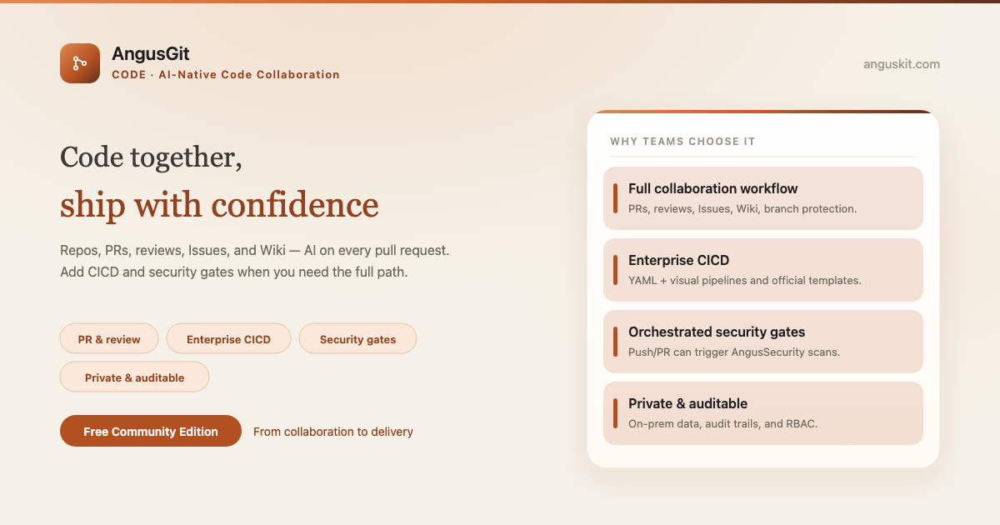
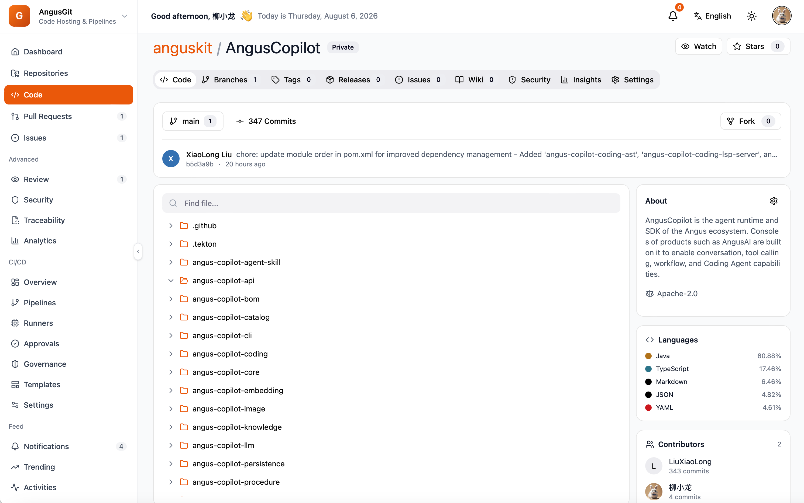

**English** | [简体中文](README.zh.md)

<p align="center">
  
</p>

<p align="center">
  <a href="https://www.anguskit.com/en/pricing"></a>
  <a href="LICENSE"></a>
  <a href="https://www.anguskit.com/en/docs/git"></a>
  <a href="https://www.anguskit.com"></a>
</p>

# AngusGit

**Code Together, Ship Confidently. Let AI Power Every Pull Request.**

AI-Native Code Collaboration — the Code product in [AngusKit](https://github.com/AngusKit/AngusKit).

> **This repository hosts documentation only.** AngusGit source code is distributed through private deployment packages, not through this GitHub repository. Earlier revisions of this repository contained application source; as of this update, distribution has moved to AngusKit's packaging pipeline (see [Get the Community Edition](#get-the-community-edition-free) below). This repository now focuses on product information, quickstart guides, and links to the full documentation site.

## What is AngusGit

AngusGit is AI-native code collaboration built around repositories and pull requests, with reviews, Issues, and a Wiki out of the box. Team, Enterprise, and Cloud editions add CICD and code traceability, and can orchestrate [AngusSecurity](https://github.com/AngusKit/AngusSecurity) gates directly in the merge flow.

## Key capabilities

- **Repository management** — full Git hosting with Smart HTTP and SSH
- **Pull Request & Review** — merge request workflow with inline review and AI-assisted review
- **CICD Pipeline** *(Team/Enterprise)* — pipelines, runners, and artifacts wired into the same platform
- **Code Traceability** *(Team/Enterprise)* — trace a change from commit to pipeline to release
- **Issues & projects** — lightweight issue tracking tied to repositories and PRs
- **Security gate orchestration** — call AngusSecurity checks before merge or release

## Screenshot

<p align="center">
  
</p>

## Get the Community Edition (free)

```bash
curl -LO https://repo.anguskit.com/raw/raw-public/AngusKit/git/AngusGit-Community-1.0.0.zip
unzip AngusGit-Community-1.0.0.zip
cd AngusGit-1.0.0/docker
cp env.example .env
docker compose --profile mysql up -d
```

- Minimum: **2 cores / 4 GB** (recommended: 4 cores / 8 GB); disk 80 GB
- Ports after install: AngusGM `8801` (sign-in), AngusGit HTTP `8803`, SSH `2222`
- Only need AngusGit? This zip includes AngusGit + AngusGM — no other product required.

Full installation guide (host ZIP, Kubernetes/Helm, TLS, upgrades): **[docs.anguskit.com/git](https://www.anguskit.com/en/docs/git/latest/en/manual/02-install-deploy)**

## Community vs. Team / Enterprise vs. SaaS

| | Community | Team / Enterprise | SaaS |
|---|---|---|---|
| Price | Free | Paid, private deployment | Paid, hosted |
| Users | Up to 10 | Higher / unlimited seats | Per plan |
| Git repositories | Up to 100 | Higher / unlimited | Per plan |
| Git storage | Self-managed | Self-managed or pooled | Per plan |
| CI hours | Not included (no CI in Community) | Included | Per plan |
| Security integration, code traceability, CICD, MCP | Not included | Included | Per plan |

Community Edition source is licensed under GPL-3.0 and distributed with each Community installation package. Team and Enterprise editions are proprietary, governed by the **XCan Business License, Version 1.0**, distributed only under a paid subscription.

Full pricing and feature comparison: **[anguskit.com/pricing](https://www.anguskit.com/en/pricing)**

## Related AngusKit products

| Product | Focus | Repository |
|---|---|---|
| AngusKit | The full suite (this product + 5 others + AngusGM) | [AngusKit/AngusKit](https://github.com/AngusKit/AngusKit) |
| AngusAI | AI agent development | [AngusKit/AngusAI](https://github.com/AngusKit/AngusAI) |
| AngusRepo | Universal artifact management | [AngusKit/AngusRepo](https://github.com/AngusKit/AngusRepo) |
| AngusTester | AI-native software testing | [AngusKit/AngusTester](https://github.com/AngusKit/AngusTester) |
| AngusSecurity | Application security & governance | [AngusKit/AngusSecurity](https://github.com/AngusKit/AngusSecurity) |
| AngusInsight | Private product analytics | [AngusKit/AngusInsight](https://github.com/AngusKit/AngusInsight) |

## Documentation & support

- Full docs: [anguskit.com/docs/git](https://www.anguskit.com/en/docs/git)
- Contact / sales: [anguskit.com/contact](https://www.anguskit.com/en/contact) · `sales@anguskit.com`
- This repository's Issues are for **documentation feedback and install troubleshooting**. This repository does not accept source code pull requests — see [CONTRIBUTING.md](CONTRIBUTING.md).

## License

- This repository's documentation content: see [LICENSE](LICENSE) (GPL-3.0, matching the Community Edition source it describes).
- AngusGit Community Edition product source: GPL-3.0, distributed with each Community installation package.
- AngusGit Team / Enterprise Edition: proprietary, XCan Business License v1.0, distributed under a paid subscription only.
