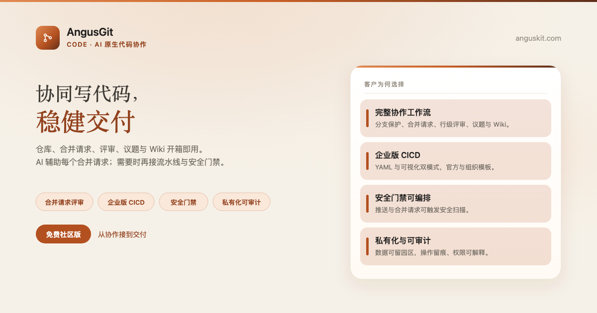
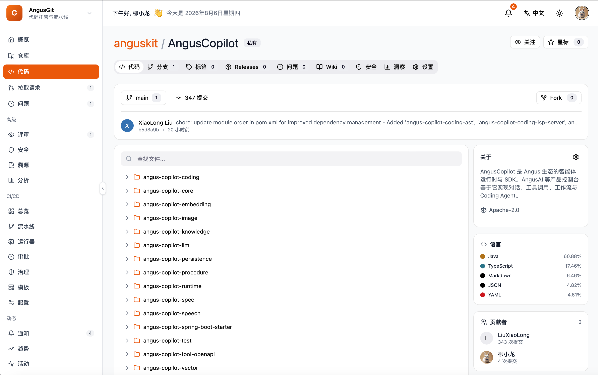

[English](README.md) | **简体中文**

<p align="center">
  
</p>

<p align="center">
  <a href="https://www.anguskit.com/zh/pricing"></a>
  <a href="LICENSE"></a>
  <a href="https://www.anguskit.com/zh/docs/git"></a>
  <a href="https://www.anguskit.com"></a>
</p>

# AngusGit

**协同写代码，稳健交付：让 AI 为每一个合并请求赋能。**

AI 原生代码协作——[AngusKit](https://github.com/AngusKit/AngusKit) 中负责 Code 的产品。

> **本仓库仅承载文档内容。** AngusGit 的产品源码通过私有化安装包分发，不在本 GitHub 仓库公开。本仓库此前版本曾包含应用源码；本次更新后，源码分发已统一收拢到 AngusKit 的打包发布流水线（见下文「免费获取社区版」）。本仓库现聚焦于产品信息、快速上手指引，以及指向完整文档站的链接。

## AngusGit 是什么

AngusGit 是以仓库与合并请求为核心的 AI 原生代码协作平台，开箱即带代码评审、议题与 Wiki。团队版、企业版与云服务版额外提供 CICD 与代码溯源，并可在合并流程中直接编排 [AngusSecurity](https://github.com/AngusKit/AngusSecurity) 门禁。

## 核心能力

- **智能仓库管理**——完整 Git 托管，支持 Smart HTTP 与 SSH
- **合并请求与代码评审**——带行内评审与 AI 辅助评审的合并请求流程
- **CICD 流水线**（团队版/企业版）——流水线、Runner 与制品在同一平台内打通
- **代码溯源**（团队版/企业版）——从提交追溯到流水线再到发布
- **议题与项目协作**——与仓库、合并请求绑定的轻量议题跟踪
- **安全门禁编排**——在合并或发布前调用 AngusSecurity 检查

## 产品截图

<p align="center">
  
</p>

## 免费获取社区版

```bash
curl -LO https://repo.anguskit.com/raw/raw-public/AngusKit/git/AngusGit-Community-1.0.0.zip
unzip AngusGit-Community-1.0.0.zip
cd AngusGit-1.0.0/docker
cp env.example .env
docker compose --profile mysql up -d
```

- 最低配置：**2 核/4 GB**（推荐 4 核/8 GB）；磁盘 80 GB
- 安装完成后端口：AngusGM `8801`（登录入口）、AngusGit HTTP `8803`、SSH `2222`
- 只需要 AngusGit？这份 zip 已包含 AngusGit + AngusGM，无需其它产品。

完整安装指南（主机 ZIP、Kubernetes/Helm、TLS、升级）：**[docs.anguskit.com/git](https://www.anguskit.com/zh/docs/git/latest/zh/manual/02-install-deploy)**

## 社区版 vs 团队版/企业版 vs SaaS

| | 社区版 | 团队版/企业版 | SaaS |
|---|---|---|---|
| 价格 | 免费 | 付费，私有化部署 | 付费，云端托管 |
| 用户数 | 最多 10 | 更高/不限席位 | 按套餐 |
| Git 仓库数 | 最多 100 | 更高/不限 | 按套餐 |
| Git 存储 | 自管 | 自管或统一配额 | 按套餐 |
| CI 时长 | 不含（社区版无 CI） | 包含 | 按套餐 |
| 安全联动、代码溯源、CICD、MCP | 不含 | 包含 | 按套餐 |

社区版源码使用 GPL-3.0 协议，随社区版安装包一同分发。团队版与企业版为专有软件，受 **XCan Business License, Version 1.0** 约束，仅随付费订阅提供。

完整定价与功能对照：**[anguskit.com/pricing](https://www.anguskit.com/zh/pricing)**

## AngusKit 关联产品

| 产品 | 定位 | 仓库 |
|---|---|---|
| AngusKit | 完整套件（本产品 + 其它 5 个 + AngusGM） | [AngusKit/AngusKit](https://github.com/AngusKit/AngusKit) |
| AngusAI | AI 智能体开发 | [AngusKit/AngusAI](https://github.com/AngusKit/AngusAI) |
| AngusRepo | 通用制品管理 | [AngusKit/AngusRepo](https://github.com/AngusKit/AngusRepo) |
| AngusTester | AI 原生软件测试 | [AngusKit/AngusTester](https://github.com/AngusKit/AngusTester) |
| AngusSecurity | 应用安全与治理 | [AngusKit/AngusSecurity](https://github.com/AngusKit/AngusSecurity) |
| AngusInsight | 私有化产品分析 | [AngusKit/AngusInsight](https://github.com/AngusKit/AngusInsight) |

## 文档与支持

- 完整文档：[anguskit.com/docs/git](https://www.anguskit.com/zh/docs/git)
- 联系/销售：[anguskit.com/contact](https://www.anguskit.com/zh/contact) · `sales@anguskit.com`
- 本仓库的 Issues 仅用于**文档反馈与安装排查**。本仓库不接受源码 Pull Request，详见 [CONTRIBUTING.md](CONTRIBUTING.md)。

## License

- 本仓库文档内容：见 [LICENSE](LICENSE)（GPL-3.0，与其描述的社区版源码保持一致）。
- AngusGit 社区版产品源码：GPL-3.0，随每个社区版安装包分发。
- AngusGit 团队版/企业版：专有软件，XCan Business License v1.0，仅随付费订阅提供。
